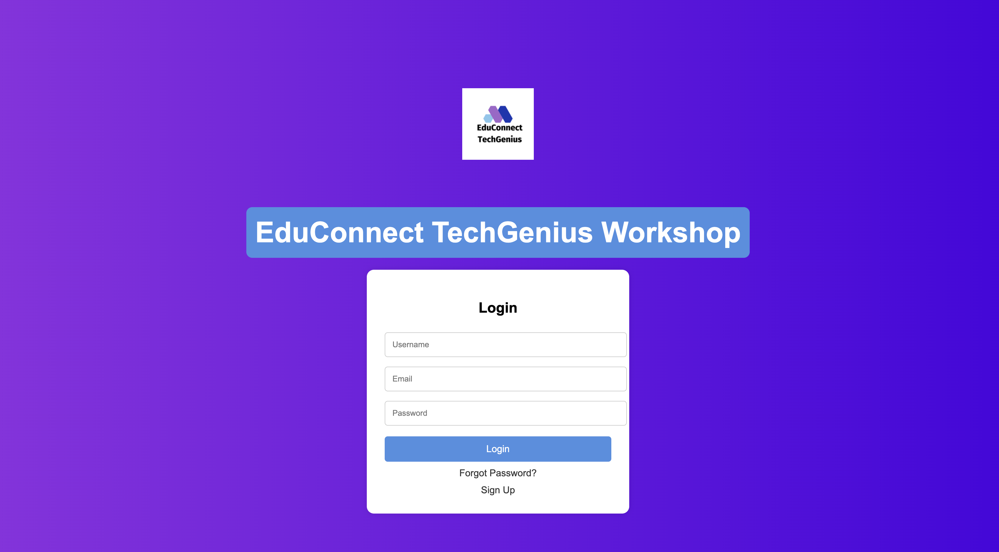
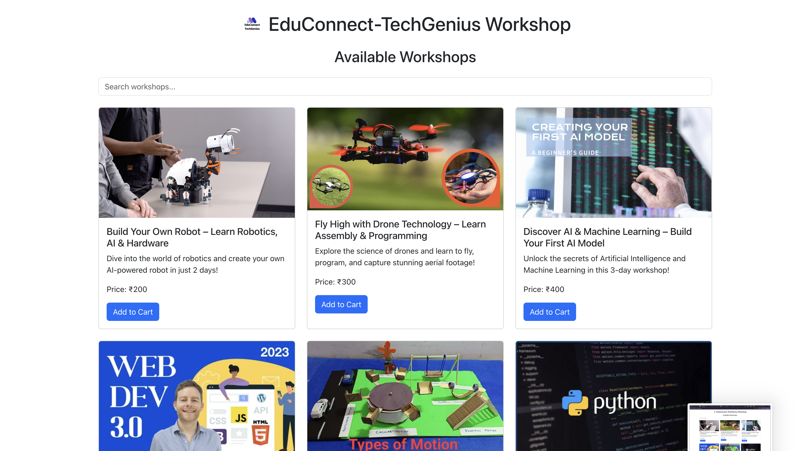
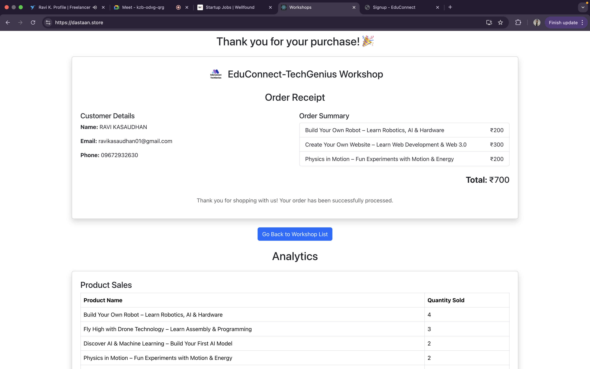
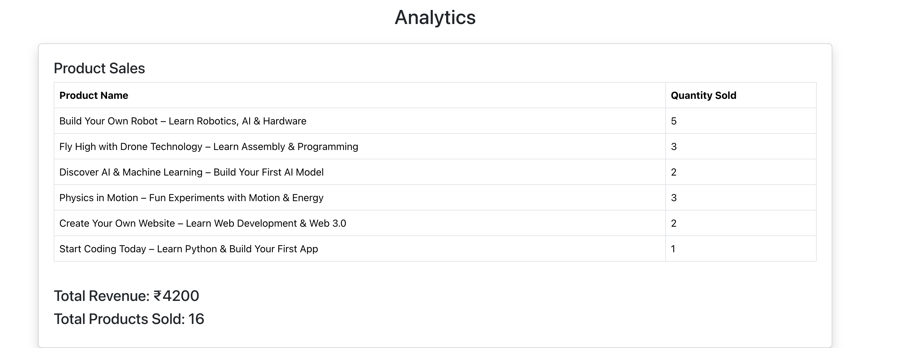
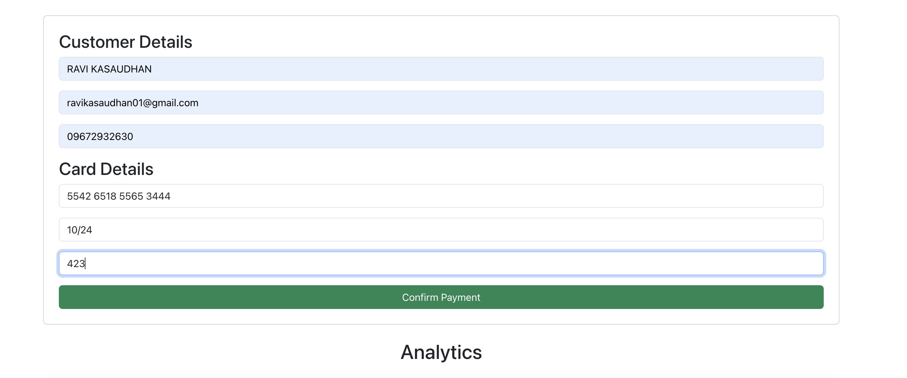
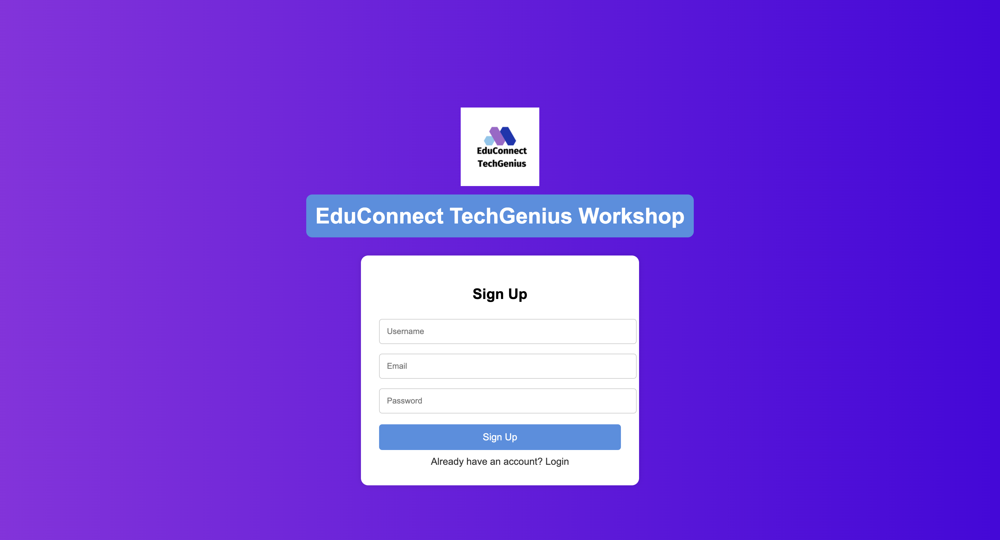

# EduConnect - TechGenius Workshop POS System
Welcome to the **EduConnect TechGenius Assignment Project**! This is a **Point of Sale (POS) Interface** built using **React** for managing workshops and services offered by EduConnect TechGenius. The interface allows users to select services, manage a cart, simulate payments, and generate receipts.
## Visit Educonnect Tech Genius
For more information, visit site-> [EduConnect TechGenius](https://dastaan.store/aad).




## Overview
EduConnect - TechGenius Workshop is a Point of Sale (POS) interface designed for selling services such as workshops, fitness classes, and therapy sessions. The platform provides an intuitive, responsive, and functional UI for users to select, manage, and purchase services.

## **Features**
1. **Select Services**:  
   - Choose from a list of available workshops (e.g., Robotics, AI, Drones, Web Development).  
   - Each workshop includes details like name, price, and duration.

2. **Add to Cart**:  
   - Add selected workshops to the cart.  
   - View and edit cart details (e.g., update quantity, remove items).  

3. **Customer Management**:  
   - Optionally add customer details (name, email, phone) during checkout.  

4. **Simulated Payment**:  
   - Simulate a payment flow (no real payment integration).  
   - Display a success message upon payment completion.  

5. **Receipt Generation**:  
   - Generate and display a receipt with transaction details (e.g., customer info, workshop details, total amount).  

6. **Responsive Design**:  
   - The interface is fully responsive and works seamlessly on both desktop and mobile devices.  

---

  CART.png
## **Tech Stack**
- **Frontend Framework**: React  
- **Styling**: Tailwind CSS  
- **State Management**: React Context API  
- **Routing**: React Router DOM  
- **Mock Data**: JSON for workshops and transactions
- 
- ## **Optional Enhancements (Bonus)**
- **Search/Filter**: Add functionality to search or filter workshops by name, price, or duration.  
- **Analytics**: Display insights like total revenue or number of workshops sold. 

## Setup Instructions
### Prerequisites
Ensure you have the following installed:
- Node.js (>= 16.0)
- npm or yarn

### Installation Steps
1. **Clone the repository**
   ```sh
   git clone https://github.com/YOUR_GITHUB_USERNAME/YOUR_REPO_NAME.git
   cd YOUR_REPO_NAME
   ```
2. **Install dependencies**
   ```sh
   npm install  # or yarn install
   ```
3. **Run the development server**
   ```sh
   npm start  # or yarn start
   ```
4. **Access the application**
   Open `http://localhost:3000/` in your browser.

   ## **Project Structure**
```
src/
├── components/       # Reusable components (e.g., WorkshopCard, CartItem)
├── pages/            # Main pages (e.g., Home, Cart, Checkout)
├── context/          # React Context for state management
├── data/             # Mock data for workshops
├── App.jsx           # Main app component
├── main.jsx          # Entry point
```

---

## **Key Functionality**
1. **Workshop Selection**:  
   - Users can browse and select workshops from the home page.  
   - Each workshop card displays details like name, price, and duration.  

2. **Cart Management**:  
   - Users can add/remove workshops and update quantities in the cart.  
   - The cart dynamically calculates the total price.  

3. **Checkout Process**:  
   - Users can enter customer details and simulate a payment.  
   - A receipt is generated upon successful payment.  

---


## Assumptions
- The payment system is mocked and does not include real transactions.
- The customer management system stores data temporarily (not persisted in a database).
- The cart system is based on frontend state and does not use a backend.

## Limitations
- No real-time updates (e.g., no WebSocket or API integration).
- No authentication or user login system implemented.
- No backend integration; all data is stored in memory/local storage.

## Screenshots
 


## License
This project is open-source and available under the [MIT License](LICENSE).

---


For any questions or feedback, feel free to reach out:  
- ** Ravi Kasaudhan
+91 9672932630 |     ravikasaudhan01@gmail.com
  
https://www.linkedin.com/in/ravikasaudhan11/ |

https://github.com/ravivit

